# Pakistani Bank Transaction Parser
## Complete User Manual

---

## Table of Contents

1. [Introduction](#introduction)
2. [System Requirements & Prerequisites](#system-requirements--prerequisites)
3. [Installation Guide](#installation-guide)
4. [First-Time Setup](#first-time-setup)
5. [Application Features](#application-features)
6. [Troubleshooting](#troubleshooting)
7. [Support & Maintenance](#support--maintenance)

---

## Introduction

### What is Pakistani Bank Transaction Parser?

The **Pakistani Bank Transaction Parser** is an automated bank slip processing system that uses advanced AI vision technology to extract transaction details from Pakistani bank slips. The application runs completely offline on your computer, ensuring complete data privacy and security.

### Key Benefits

- ✅ **100% Offline Processing** - No internet required after installation
- ✅ **AI-Powered OCR** - Automatically extracts all transaction details
- ✅ **Multi-Bank Support** - Works with all major Pakistani banks
- ✅ **Secure Database** - Stores all transactions in MS SQL Server
- ✅ **Batch Processing** - Automatically processes slips dropped in a monitored folder
- ✅ **Export Capabilities** - Download data as CSV or Excel
- ✅ **Real-time Dashboard** - View and filter all saved transactions

### What's Included

- Complete Python runtime environment
- AI Vision Model (Qwen3-VL-2B, ~1.5GB)
- llama.cpp inference engine
- MS SQL Server database connector
- Streamlit web interface
- Batch processing service
- All required dependencies

### License Information

This application is licensed to **Candle Threads** for internal business use only. By using this system, you agree that:

- The software may only be used by authorized company personnel
- Bank slips and financial data must be handled securely and confidentially
- The application may not be copied, modified, reverse engineered, or shared with third parties
- Users are responsible for verifying the accuracy of extracted data
- JFF Consultants is not liable for losses, inaccuracies, or damages resulting from system use

All intellectual property rights remain with **JFF Consultants**.

---

## System Requirements & Prerequisites

### Minimum Hardware Requirements

| Component | Minimum | Recommended |
|-----------|---------|-------------|
| **Operating System** | Windows 10 (64-bit) | Windows 11 (64-bit) |
| **Processor** | Intel Core i5 or AMD equivalent | Intel Core i7 or higher |
| **RAM** | 8 GB | 16 GB or more |
| **Storage** | 5 GB free space | 10 GB free space |
| **Display** | 1366x768 resolution | 1920x1080 or higher |

### Required Software Prerequisites

Before installing the Pakistani Bank Transaction Parser, you must install the following software:

---

#### 1. Microsoft Visual C++ Redistributable

**Purpose:** Required for the AI inference engine and Python runtime to function properly.

**Download Link:** [Microsoft Visual C++ Redistributable Latest](https://learn.microsoft.com/en-us/cpp/windows/latest-supported-vc-redist)

**Installation Steps:**
1. Click the link above to visit Microsoft's official download page
2. Download **both** versions:
   - `vc_redist.x64.exe` (64-bit version)
   - `vc_redist.x86.exe` (32-bit version - for compatibility)
3. Run both installers
4. Click "I agree to the license terms and conditions"
5. Click "Install"
6. Click "Close" when installation completes
7. Restart your computer

**Note:** If already installed, the installer will show "Repair" or "Uninstall" options. In this case, no action is needed.

---

#### 2. Microsoft SQL Server (2014 or Higher)

**Purpose:** Database engine for storing all transaction records.

**Recommended Version:** SQL Server 2019 Express (Free)

**Download Link:** [SQL Server Downloads](https://www.microsoft.com/en-us/sql-server/sql-server-downloads)

**Installation Steps:**

1. **Download SQL Server:**
   - Visit the link above
   - Scroll to "Express" edition
   - Click "Download now"

2. **Run the Installer:**
   - Double-click the downloaded file
   - Select **"Basic"** installation type
   - Accept the license agreement
   - Choose installation location (default is recommended)
   - Click "Install"

3. **Wait for Installation:**
   - Installation takes 5-15 minutes
   - Do not close the installer window

4. **Note the Instance Name:**
   - After installation, note the instance name shown (usually `MSSQLSERVER` or `SQLEXPRESS`)
   - You'll need this during application installation

---

#### 3. Enable TCP/IP Protocol for SQL Server

**CRITICAL STEP:** By default, SQL Server disables network connections. You must enable TCP/IP for the application to connect.

**Steps:**

1. **Open SQL Server Configuration Manager:**
   - Press `Windows Key`
   - Type: "SQL Server Configuration Manager"
   - Press Enter

2. **Navigate to Protocols:**
   - In the left panel, expand **"SQL Server Network Configuration"**
   - Click **"Protocols for MSSQLSERVER"** (or your instance name)

3. **Enable TCP/IP:**
   - Right-click **"TCP/IP"**
   - Select **"Enable"**
   - A message will appear saying restart is required - Click OK

4. **Configure TCP/IP Port:**
   - Right-click **"TCP/IP"** again
   - Select **"Properties"**
   - Click the **"IP Addresses"** tab
   - Scroll to the bottom to **"IPAll"** section
   - Set **"TCP Port"** to `1433`
   - Click **"OK"**

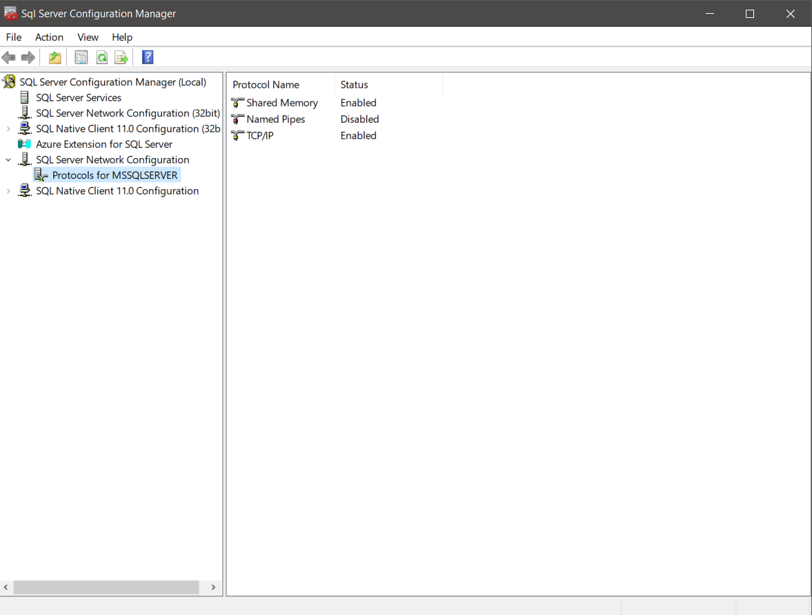

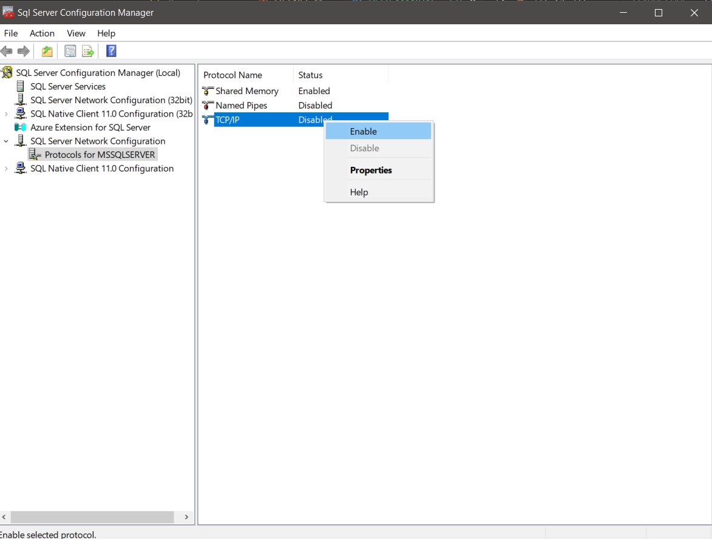

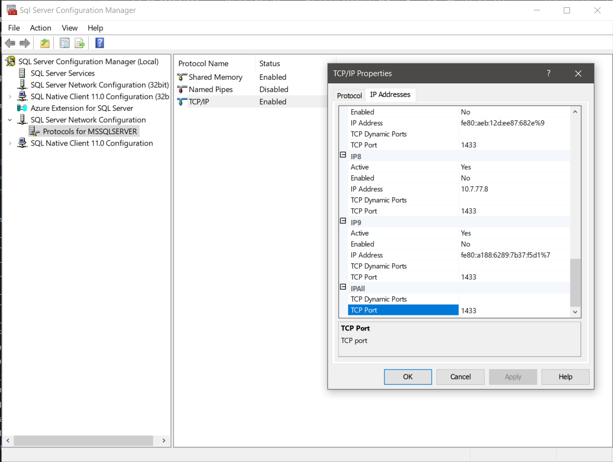

5. **Restart SQL Server Service:**
   - In Configuration Manager, click **"SQL Server Services"** in left panel
   - Right-click **"SQL Server (MSSQLSERVER)"**
   - Select **"Restart"**
   - Wait for status to show "Running" with a green arrow

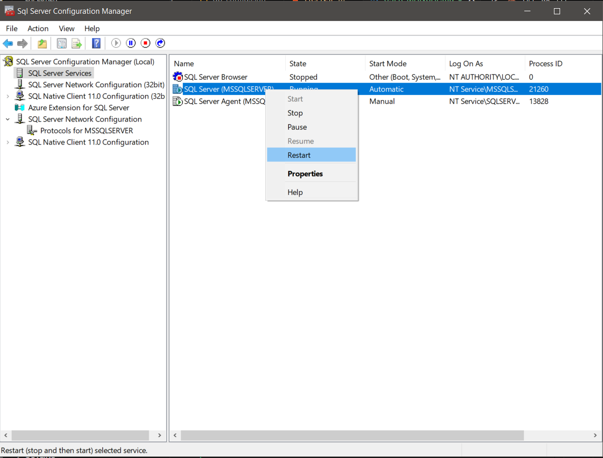

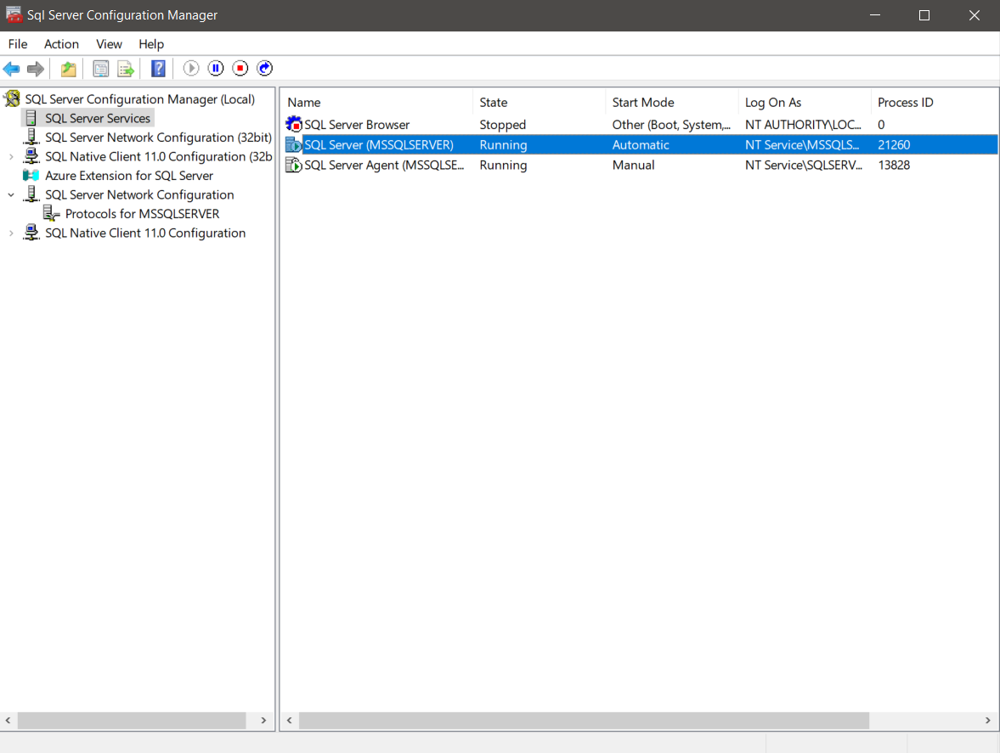

---

#### 4. Microsoft ODBC Driver 17 for SQL Server

**Purpose:** Allows the application to communicate with SQL Server database.

**Download Link:** [ODBC Driver 17 for SQL Server](https://learn.microsoft.com/en-us/sql/connect/odbc/download-odbc-driver-for-sql-server)

**Installation Steps:**

1. Visit the download link above
2. Download **"ODBC Driver 17 for SQL Server (x64)"**
3. Run the installer (`msodbcsql.msi`)
4. Click "Next"
5. Accept the license agreement
6. Click "Next" → "Next" → "Install"
7. Click "Finish" when complete
---

#### 5. SQL Server Command Line Utilities (sqlcmd)

**Purpose:** Required by the installer to validate database connection during setup.

**Download Link:** [SQL Server Command Line Utilities](https://learn.microsoft.com/en-us/sql/tools/sqlcmd-utility)

**Installation Steps:**

1. Visit the link above
2. Download **"Microsoft Command Line Utilities 15 for SQL Server"**
3. Run the installer
4. Accept license agreement
5. Click "Next" → "Install"
6. Click "Finish"

**Verification:**
- Open Command Prompt
- Type: `sqlcmd -?`
- If you see help text, installation was successful

---

### Prerequisites Checklist

Before proceeding to install the Pakistani Bank Transaction Parser, ensure you have completed ALL of the following:

- [ ] Microsoft Visual C++ Redistributable (both x86 and x64) installed
- [ ] SQL Server (2014 or higher) installed
- [ ] TCP/IP protocol enabled in SQL Server Configuration Manager
- [ ] TCP Port 1433 configured
- [ ] SQL Server service restarted and running
- [ ] ODBC Driver 17 for SQL Server installed
- [ ] sqlcmd utilities installed
- [ ] Computer restarted (recommended)

---

## Installation Guide

### Step 1: Run the Installer

1. Locate the installer file: **`PakistanBankParser_Setup_v1.0.0.exe`**
2. Double-click the file to launch the installer

**Note:** Windows may show a security warning. This is normal for new applications.
3. Click **"Yes"** or **"Run anyway"** to proceed

**Important:** If you encounter any error windows during installation that seem minor (e.g., temporary file access issues), you can safely ignore them and click "OK" or "Continue" to proceed with the installation.

---

### Step 2: Welcome Screen

The installer will open with a welcome message.

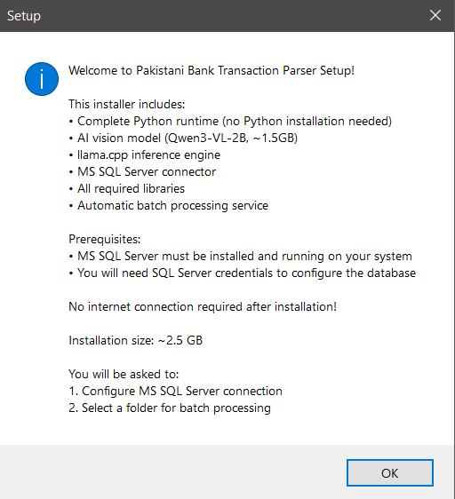

**What You'll See:**
- Application name and version
- List of included components
- Prerequisites reminder
- Installation size information (~2.5 GB)

**Action Required:**
- Read the welcome message
- Ensure you have completed all prerequisites
- Click **"Next"** to continue

---

### Step 3: License Agreement

You must accept the license agreement to proceed.
**What You'll See:**
- Full license text
- Terms of use for Candle Threads
- Data privacy and security clauses

**Action Required:**
- Read the license agreement carefully
- Check the box: **"I accept the agreement"**
- Click **"Next"**

---

### Step 4: MS SQL Server Authentication Type

Choose how you want to connect to your SQL Server database.

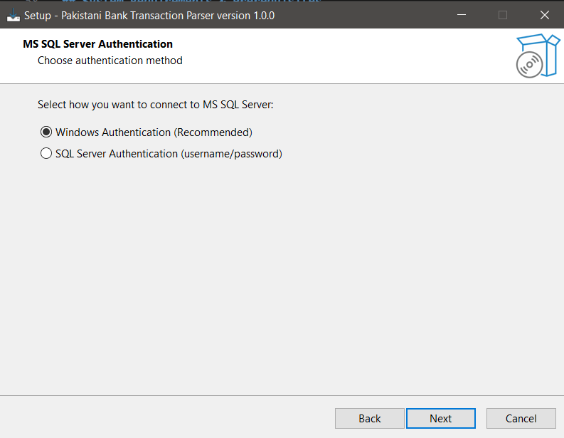

**What You'll See:**
Two options:
1. **Windows Authentication (Recommended)**
   - Uses your Windows login credentials
   - No password required
   - More secure
   - **Select this option** if you installed SQL Server on the same computer

2. **SQL Server Authentication**
   - Uses SQL Server username and password
   - Requires `sa` or other SQL login
   - Select this only if specifically required by your IT department

**Action Required:**
- Select **"Windows Authentication (Recommended)"**
- Click **"Next"**

---

### Step 5: MS SQL Server Configuration

Enter your SQL Server connection details.

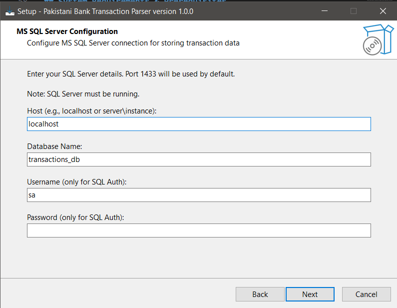

**What You'll See:**
Four input fields:
1. **Host** - Server name or IP address
2. **Database Name** - Name of the database to create
3. **Username** - (Only for SQL Server Authentication)
4. **Password** - (Only for SQL Server Authentication)

**What to Enter:**

| Field | Value | Notes |
|-------|-------|-------|
| **Host** | `localhost` | If SQL Server is on the same computer (most common) |
| | `localhost\SQLEXPRESS` | If you installed SQL Server Express edition |
| | `SERVERNAME\INSTANCENAME` | If using a named instance |
| **Database Name** | `transactions_db` | Default name (recommended) |
| | `YourCustomName` | You can use any name you prefer |
| **Username** | Leave empty | For Windows Authentication |
| | `sa` | Only if using SQL Server Authentication |
| **Password** | Leave empty | For Windows Authentication |
| | Enter password | Only if using SQL Server Authentication |

**Action Required:**
1. Enter the host (usually `localhost`)
2. Enter database name (or keep default `transactions_db`)
3. If using Windows Authentication, leave Username and Password empty
4. Click **"Next"**

**Note:** The installer will validate your connection.

**If a connection failure dialog appears, you can ignore it and click "OK" to continue.** The application will attempt to create the database on first launch.

If you want to ensure the connection is working, verify:
- SQL Server is running
- TCP/IP is enabled
- Port 1433 is configured
- Credentials are correct (if using SQL Server Authentication)

---

### Step 6: Bank Slips Folder Selection

Choose a folder where you'll drop bank slips for automatic processing.

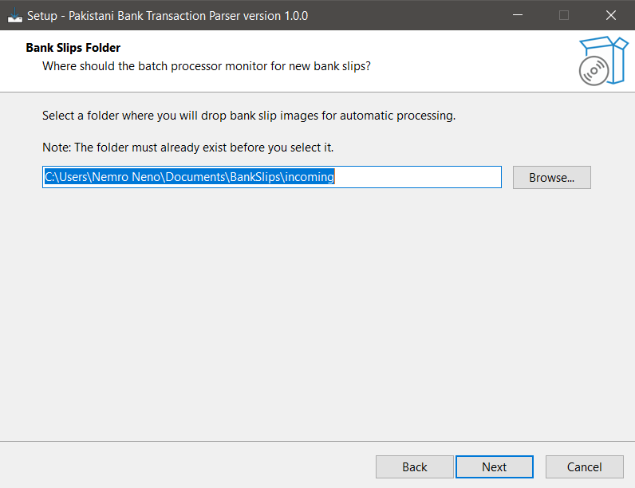

**What You'll See:**
- Folder browser
- Default suggested path: `C:\Users\YourName\Documents\BankSlips\incoming`

**Action Required:**

**Option A: Use the suggested folder**
1. Click **"Create Folder"** if the folder doesn't exist
2. Navigate to `Documents`
3. Create new folder: `BankSlips`
4. Inside it, create subfolder: `incoming`
5. Select the `incoming` folder
6. Click **"OK"**

**Option B: Choose your own folder**
1. Click **"Browse"**
2. Navigate to your preferred location
3. Create a new folder if needed
4. Select the folder
5. Click **"OK"**

**Important Notes:**
- The folder MUST exist before you select it
- Do NOT select a system folder (C:\Windows, C:\Program Files, etc.)
- Choose a location with sufficient storage space
- This folder will be monitored 24/7 for new bank slips
7. Click **"Next"** to continue

---

### Step 7: Installation Directory

Choose where to install the application.
**What You'll See:**
- Default path: `C:\Program Files\Pakistani Bank Transaction Parser`
- Browse button to change location
- Disk space required: ~2.5 GB

**Action Required:**
- Use the default location (recommended)
- Or click **"Browse"** to choose a different location
- Ensure you have at least 3 GB free space
- Click **"Next"**

---

### Step 8: Start Menu Folder

Choose the Start Menu folder name.
**What You'll See:**
- Default folder name: "Pakistani Bank Transaction Parser"
- Option to create desktop shortcut

**Action Required:**
- Keep the default name (recommended)
- Check **"Create a desktop icon"** if you want a desktop shortcut
- Click **"Next"**

---

### Step 9: Ready to Install

Review your installation settings before proceeding.
**What You'll See:**
- Installation directory
- MS SQL Server settings
- Bank slips folder location
- Start menu folder
- Disk space information

**Action Required:**
- Review all settings carefully
- Click **"Back"** if you need to change anything
- Click **"Install"** to begin installation

---

### Step 10: Installing

The installation process begins.
**What You'll See:**
- Progress bar
- Current file being installed
- Estimated time remaining

**What's Happening:**
- Copying application files (~2.5 GB)
- Installing Python runtime
- Installing AI model files
- Setting up llama.cpp engine
- Creating database configuration
- Validating SQL Server connection

**Time Required:** 5-15 minutes depending on your system

**Important:** 
- Do NOT close the installer window
- Do NOT turn off your computer
- If you see minor error dialogs, click "OK" or "Ignore" to continue

---

### Step 11: Installation Complete

Installation has finished successfully!

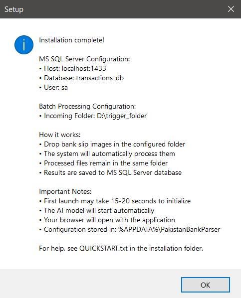

**What You'll See:**
- Success message
- Summary of configuration:
  - MS SQL Server host and database
  - Batch processing folder location
  - Configuration file location: `%APPDATA%\PakistanBankParser`
- Checkbox: **"Launch Pakistani Bank Transaction Parser"**

**Action Required:**
1. Review the configuration summary
2. Check the box **"Launch Pakistani Bank Transaction Parser"** if you want to start the app now
3. Click **"Finish"**
---

### Post-Installation Notes

After clicking "Finish":

1. **If you checked "Launch Application":**
   - A console window (black screen) will appear - **DO NOT CLOSE IT**
   - Wait 15-20 seconds for the AI model to load
   - Your default web browser will automatically open
   - You'll see the application at `http://localhost:8501`

2. **If you didn't check "Launch Application":**
   - Find the application in your Start Menu
   - Or use the desktop shortcut (if created)
   - Or navigate to installation folder and run `PakistanBankParser.exe`

---

## First-Time Setup

### Launching the Application

**Method 1: Desktop Shortcut**
- Double-click the **"Pakistani Bank Transaction Parser"** icon on your desktop

**Method 2: Start Menu**
- Press the Windows key
- Type: "Pakistani Bank Transaction Parser"
- Click the application

**Method 3: Direct Execution**
- Navigate to: `C:\Program Files\Pakistani Bank Transaction Parser`
- Double-click `PakistanBankParser.exe`
---

### First Launch Experience

**What You'll See:**

1. **Console Window (Black Screen)**
   - This is the application server
   - Shows technical logs
   - **DO NOT CLOSE THIS WINDOW**
   - Minimize it if needed, but don't close it
2. **Initial Loading Messages:**
   ```
   Starting llama.cpp server...
   Loading AI model: Qwen3-VL-2B...
   Model loaded successfully!
   Starting Streamlit server...
   Server running at: http://localhost:8501
   ```

3. **Browser Opens Automatically:**
   - Your default web browser will open after 15-20 seconds
   - URL: `http://localhost:8501`
   - If the browser doesn't open, manually navigate to this URL
---

### Understanding the Interface

When the application loads in your browser, you'll see the main interface.

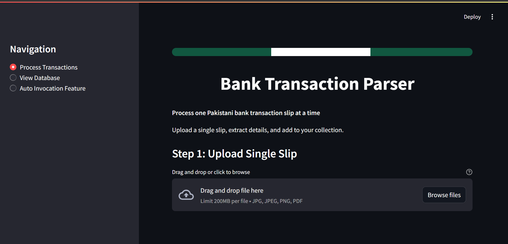

**Interface Components:**

1. **Header Section:**
   - Pakistan flag color theme (green and white)
   - Application title: "Pakistani Bank Transaction Parser"
   - Subtitle explaining the application's purpose

2. **Left Sidebar:**
   - Navigation menu with three pages:
     - **Process Transactions** (Main processing page)
     - **View Database** (See all saved transactions)
     - **Auto Invocation Feature** (Batch processing settings)

3. **Main Content Area:**
   - File upload section
   - Processing controls
   - Results display

---

### Verifying Database Connection

Before processing your first slip, verify the database connection is working.

**Steps:**

1. Click **"View Database"** in the left sidebar
2. Check for the success message:
   - "✅ Database 'transactions_db' is ready"
   - If you see an error, refer to [Troubleshooting](#troubleshooting)

3. You should see:
   - "📭 No transactions saved yet" (this is normal on first launch)
   - Database summary metrics (showing 0 records)
---

## Application Features

The application has three main sections accessible from the left sidebar:

1. **Process Transactions** - Upload and process bank slips manually
2. **View Database** - View, search, filter, and export saved transactions
3. **Auto Invocation Feature** - Configure automatic batch processing

---

### Feature 1: Process Transactions (Manual Processing)

This is the main page for manually uploading and processing individual bank slips.

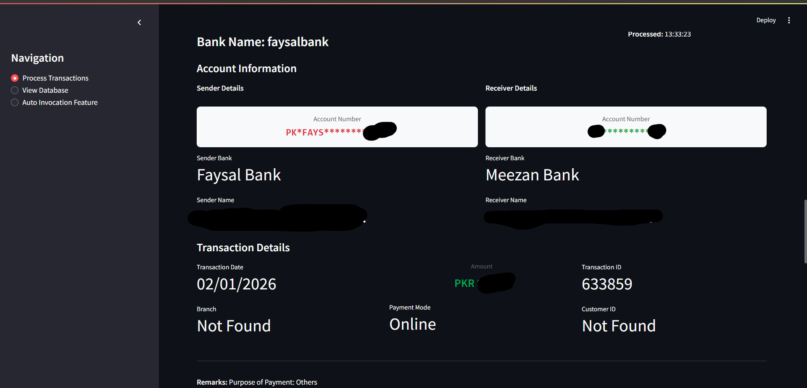

---

#### How to Process a Bank Slip

**Step 1: Upload a Slip**

1. Navigate to **"Process Transactions"** page (default page on launch)

2. Locate the upload section:
   - **"Step 1: Upload Single Slip"**
   - Drag-and-drop zone with dashed border

3. Upload a file using either method:
   - **Drag and drop:** Drag an image file and drop it in the upload zone
   - **Browse:** Click "Browse files" and select from your computer

   **Supported file types:**
   - JPG/JPEG images
   - PNG images
   - PDF files (first page will be used)

4. **File Preview:**
   - After upload, you'll see a preview of the slip
   - File information is displayed:
     - File name
     - File type
     - File size in KB
---

**Step 2: Process the Slip**

1. Locate **"Step 2: Extract Data"** section
2. Click the **"Process This Slip"** button (blue, full-width)
3. **Processing Indicator:**
   - A spinner appears: "Extracting transaction details..."
   - Processing takes 30-90 seconds depending on your CPU
   - **Do not navigate away or refresh the page**
4. **First-time Processing:**
   - The very first slip may take 75-150 seconds
   - This is normal - the AI model is initializing
   - Subsequent slips will process much faster

---

**Step 3: Review Extracted Data**

Once processing completes, you'll see the extracted transaction details.

**What You'll See:**

1. **Success Message:**
   - "✅ Successfully processed: [filename]"
   - "✅ Transaction saved to database!"

2. **Transaction Details Card:**
   - Color-coded border (green for Meezan Bank, red for HBL, etc.)
   - All extracted fields displayed in a structured format:

| Field | Description | Example |
|-------|-------------|---------|
| **Bank Name** | Source bank of the transaction | Meezan Bank |
| **Date** | Transaction date | 15-Jan-2024 |
| **Transaction ID** | Unique transaction identifier | TXN123456789 |
| **Amount** | Transaction amount | PKR 50,000.00 |
| **From Account** | Sender account name | Muhammad Ali |
| **From Account Number** | Sender account number | 0123456789012 |
| **From Bank Name** | Sender's bank | Meezan Bank |
| **To Account** | Receiver account name | Ayesha Khan |
| **To Account Number** | Receiver account number | 9876543210987 |
| **To Bank Name** | Receiver's bank | HBL |
| **Branch** | Branch name/code | Main Branch |
| **Payment Mode** | Transfer type | IBFT |
| **Customer ID** | Customer identifier | CUST001 |
| **Cheque No** | Cheque number (if applicable) | N/A |
| **Remarks** | Additional notes | Salary payment |
3. **Data Accuracy:**
   - Review all extracted fields carefully
   - The AI extracts data with high accuracy but verification is recommended
   - If any field shows "Not Found", the AI couldn't locate that information in the slip

---

**Step 4: Process Another Slip (Optional)**

1. Scroll back to the top
2. Upload a new file
3. Previous results will be replaced with the new transaction
4. Each transaction is automatically saved to the database

---

#### Supported Banks

The application works with transaction slips from **all Pakistani banks**, including:

**Major Banks:**
- Meezan Bank
- Habib Bank Limited (HBL)
- United Bank Limited (UBL)
- Bank Alfalah
- Allied Bank
- MCB Bank Limited
- Standard Chartered Bank
- National Bank of Pakistan
- Faysal Bank
- Bank Islami
- JS Bank
- Askari Bank
- Soneri Bank
- Dubai Islamic Bank
- Silk Bank
- Summit Bank
- Samba Bank
- Bank Al Habib

**Regional/Smaller Banks:**
- And virtually any other Pakistani bank's transaction slips
---

### Feature 2: View Database

This page allows you to view, search, filter, and export all saved transactions.

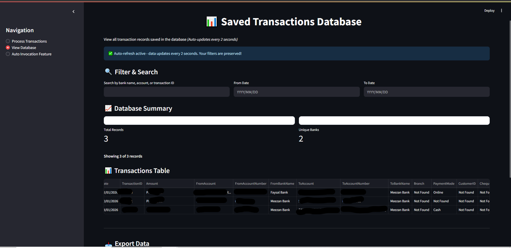

---

#### Accessing the Database View

1. Click **"View Database"** in the left sidebar
2. The page displays all transactions saved in the MS SQL Server database
---

#### Database Dashboard Features

**Auto-Refresh Indicator:**
- Top of the page shows: "✅ Auto-refresh active - data updates every 2 seconds"
- Manual refresh button (🔄) in top-right corner
- Your filters are preserved during auto-refresh
---

#### Database Summary Metrics

At the top of the page, you'll see summary statistics:
**Metrics Displayed:**
- **Total Records:** Total number of transactions saved
- **Unique Banks:** Number of different banks represented

---

#### Search and Filter Options

Use these tools to find specific transactions quickly.

**Filter Controls:**

1. **Search Box:**
   - Enter keywords to search in:
     - Bank name
     - Account holder names
     - Transaction ID
     - Any text field
   - Search updates as you type

2. **From Date:**
   - Select a start date
   - Shows transactions from this date forward
   - Click the calendar icon to pick a date

3. **To Date:**
   - Select an end date
   - Shows transactions up to this date
   - Leave blank to show all dates after "From Date"

**Example Filters:**
- **Find all Meezan Bank transactions:** Type "Meezan" in search box
- **Find transactions in January 2024:** Set From Date = 01-Jan-2024, To Date = 31-Jan-2024
- **Find a specific account:** Type the account number in search box

---

#### Transaction Data Table

All transactions are displayed in a sortable, filterable table.
**Table Features:**

1. **Column Headers:**
   - Click any column header to sort
   - Click again to reverse sort order
   - Sorted column is highlighted

2. **Columns Displayed:**
   - ID
   - Bank Name
   - Date
   - Transaction ID
   - Amount
   - From Account
   - To Account
   - Payment Mode
   - File Name
   - Created At (timestamp)

3. **Pagination:**
   - If you have many records, they'll be split across multiple pages
   - Navigate using page numbers at the bottom
---

#### Export Options

Export your transaction data to CSV or Excel format.
**How to Export:**

1. **Export to CSV:**
   - Click **"Download as CSV"** button
   - File will download: `transactions_YYYYMMDD_HHMMSS.csv`
   - Open with Excel, Google Sheets, or any spreadsheet software

2. **Export to Excel:**
   - Click **"Download as Excel"** button
   - File will download: `transactions_YYYYMMDD_HHMMSS.xlsx`
   - Opens directly in Microsoft Excel

**Export Features:**
- Exports ALL transactions (not just current page)
- Includes all fields
- If filters are applied, exports only filtered results
- Filename includes date and time for version control

---

#### Delete All Records

**CAUTION:** This permanently deletes all transactions from the database.
**How to Delete:**

1. Click **"🗑️ Delete All Records"** button
2. A warning appears: "⚠️ Click again to confirm deletion of ALL records"
3. Click the button again to confirm
4. All records are permanently deleted
5. Success message: "✅ All records deleted!"

**Warning:** This action cannot be undone. Make sure to export your data before deleting if you need a backup.

---

### Feature 3: Auto Invocation Feature (Batch Processing)

This powerful feature monitors a folder and automatically processes any bank slips dropped into it.

---

#### What is Batch Processing?

**Batch Processing** allows you to:
- Drop multiple bank slips into a monitored folder
- Application automatically detects new files
- Processes them without manual intervention
- Saves results to database
- Leaves original files untouched

**Use Cases:**
- Process large volumes of slips overnight
- Set up a shared folder for multiple users
- Automate routine transaction entry
- Background processing while you work on other tasks

---

#### Batch Processing Status

At the top of the page, you'll see the current status.
**Status Indicators:**

**When Enabled:**
- 🟢 **"Batch processing is ENABLED"** (green badge)
- **Monitoring Folder:** Shows the folder path being watched
- **Status:** "✅ Actively watching for new bank slips"

**When Disabled:**
- 🔴 **"Batch processing is DISABLED"** (red badge)
- **Status:** "⏸️ Not monitoring any folder"

---

#### Configuration Settings
**Settings Available:**

1. **Enable/Disable Batch Processing:**
   - Toggle switch to turn feature on/off
   - Changes take effect immediately

2. **Monitored Folder:**
   - Shows the folder path configured during installation
   - Example: `C:\Users\YourName\Documents\BankSlips\incoming`
   - Cannot be changed from UI (requires reinstallation to change)

3. **Debounce Delay:**
   - Time to wait after file creation before processing
   - Default: 3 seconds
   - Prevents processing incomplete file copies
   - Adjust if you're copying very large files

4. **Inference Timeout:**
   - Maximum time to wait for AI processing per slip
   - Default: 300 seconds (5 minutes)
   - Increase if processing very complex/large images

**How to Change Settings:**

1. Modify the values in the configuration section
2. Click **"Save Configuration"** button
3. Settings are saved to: `%APPDATA%\PakistanBankParser\config\batch_config.json`
4. Changes take effect on next file detection

---

#### How Batch Processing Works
**Workflow:**

1. **Drop Files:**
   - Copy/move bank slip images to the monitored folder
   - Supported formats: JPG, PNG, PDF

2. **Automatic Detection:**
   - Application detects new files within 1-3 seconds
   - Waits for debounce delay to ensure file is completely copied

3. **Processing:**
   - AI extracts transaction details
   - Progress shown in real-time activity log

4. **Saving:**
   - Successful extractions saved to database automatically
   - Original files remain in the folder (not deleted or moved)

5. **Error Handling:**
   - Failed processing attempts are logged
   - Check logs for details on any failures

**Important Notes:**
- Files are NOT deleted or moved after processing
- Files are NOT processed more than once (tracked by filename hash)
- You can process the same file again by renaming it

---

#### Real-Time Activity Log

The activity log shows live updates of batch processing operations.

**What You'll See:**

**Recent Activity:**
- Last 10 processing events
- Newest events at the top
- Auto-updates every 2 seconds

**Log Entry Format:**
```
[2024-02-07 14:35:22] ✅ Processed: slip_001.jpg → Transaction saved to database
[2024-02-07 14:35:45] ⏳ Processing: slip_002.png...
[2024-02-07 14:36:10] ✅ Processed: slip_002.png → Transaction saved to database
[2024-02-07 14:36:15] ❌ Error processing slip_003.pdf: Invalid image format
```

**Log Indicators:**
- ✅ **Success** - File processed and saved
- ⏳ **Processing** - Currently being analyzed
- ❌ **Error** - Processing failed (check detailed logs)
- 🔍 **Detected** - New file detected, waiting to process

---

#### Viewing Detailed Logs

For troubleshooting or auditing, view complete processing logs.
**How to Access Logs:**

1. Scroll to **"📋 View Batch Processing Logs"** section
2. Select a log file from the dropdown (shows last 5 logs)
3. Click **"View Selected Log"**
4. Log contents display below
**Log File Information:**
- Each batch processing session creates a new log file
- Format: `batch_processor_YYYYMMDD_HHMMSS.log`
- Logs include:
  - Timestamp for each action
  - File detection events
  - Processing start/end times
  - Errors with full stack traces
  - Database save confirmations

**Log Location:**
- Stored in: `%APPDATA%\PakistanBankParser\logs\`
- Can be opened with any text editor
- Useful for technical support or debugging

---

#### Tips for Effective Batch Processing

**Best Practices:**

1. **Organize Your Files:**
   - Keep incoming folder clean
   - Remove processed files periodically to avoid confusion
   - Use descriptive filenames

2. **Monitor Performance:**
   - Check activity log periodically
   - Review error logs if issues occur
   - Ensure sufficient disk space

3. **File Naming:**
   - Use unique, descriptive names
   - Avoid special characters
   - Include date/sequence in filename

4. **Large Batches:**
   - For 100+ files, process in smaller batches
   - Give the system time to complete each batch
   - Monitor system resources (CPU, RAM)

5. **Quality Control:**
   - Periodically review "View Database" page
   - Verify extracted data accuracy
   - Export backups regularly

---

## Troubleshooting

### Common Issues and Solutions

---

#### Issue 1: Application Won't Start

**Symptoms:**
- Double-clicking the executable does nothing
- Console window appears and immediately closes
- Error message: "Application failed to start"

**Solutions:**

**Solution A: Check Prerequisites**
1. Verify Visual C++ Redistributable is installed
2. Reinstall if necessary (both x86 and x64 versions)
3. Restart computer

**Solution B: Run as Administrator**
1. Right-click `PakistanBankParser.exe`
2. Select "Run as administrator"
3. Click "Yes" on UAC prompt

**Solution C: Check Port Availability**
1. Open Command Prompt
2. Type: `netstat -ano | findstr :8501`
3. If port 8501 is in use:
   - Find the process ID (PID)
   - Open Task Manager
   - End the process using that port
4. Retry launching the application
---

#### Issue 2: Browser Doesn't Open Automatically

**Symptoms:**
- Console window shows "Server running" but browser doesn't open
- Have to manually navigate to localhost

**Solutions:**

**Solution A: Manual Navigation**
1. Open any web browser
2. Type in address bar: `http://localhost:8501`
3. Press Enter

**Solution B: Check Default Browser**
1. Set a default browser in Windows settings
2. Relaunch the application

**Solution C: Firewall Blocking**
1. Open Windows Defender Firewall
2. Click "Allow an app through firewall"
3. Find "PakistanBankParser.exe"
4. Check both "Private" and "Public" boxes
5. Click OK
6. Relaunch application

---

#### Issue 3: Database Connection Failed

**Symptoms:**
- Error: "Cannot connect to database"
- Error: "Login failed for user"
- Error: "TCP Provider: No connection could be made"

**Solutions:**

**Solution A: Verify SQL Server is Running**
1. Open Services (Press Win+R, type `services.msc`)
2. Find "SQL Server (MSSQLSERVER)"
3. If status is not "Running":
   - Right-click → Start
4. Wait for status to show "Running"
**Solution B: Check TCP/IP is Enabled**
1. Open SQL Server Configuration Manager
2. Navigate to: SQL Server Network Configuration → Protocols for MSSQLSERVER
3. Verify TCP/IP shows "Enabled"
4. If not:
   - Right-click TCP/IP → Enable
   - Restart SQL Server service

**Solution C: Verify Credentials**
1. Navigate to: `%APPDATA%\PakistanBankParser\config\`
2. Open `db_config.json` in Notepad
3. Verify:
   - `"host": "localhost"` (or correct server name)
   - `"port": 1433`
   - `"trusted_connection": true` (for Windows Authentication)
4. If using SQL Server Authentication:
   - Verify username and password are correct
5. Save any changes
6. Restart application

**Solution D: Recreate Database**
1. Open SQL Server Management Studio (if installed)
2. Connect to your SQL Server
3. Check if `transactions_db` database exists
4. If exists but corrupted:
   - Right-click database → Delete
5. Restart application (it will recreate the database)

---

#### Issue 4: Slow Processing Speed

**Symptoms:**
- Processing takes more than 2-3 minutes per slip
- Application feels sluggish
- High CPU usage

**Solutions:**

**Solution A: Close Other Applications**
1. Open Task Manager (Ctrl+Shift+Esc)
2. Close unnecessary applications
3. Especially close:
   - Web browsers with many tabs
   - Video editing software
   - Games
4. Free up RAM and CPU resources

**Solution B: First-Time Processing**
- First slip always takes 75-150 seconds
- This is normal - model is initializing
- Subsequent slips will be much faster (30-90 seconds)

**Solution C: Check System Resources**
1. Task Manager → Performance tab
2. Check:
   - CPU usage (should not be 100% sustained)
   - Memory usage (should have at least 2GB free)
   - Disk usage (should not be 100%)
3. If any resource is maxed out:
   - Close applications
   - Consider upgrading hardware

**Solution D: Image Size Optimization**
- Very large images (>10 MB) take longer to process
- Resize images to max 2000x2000 pixels before uploading
- Use JPEG format instead of PNG for smaller file size

---

#### Issue 5: "Model Not Found" Error

**Symptoms:**
- Error: "Model file not found"
- Error: "Failed to load model.gguf"
- Processing fails immediately

**Solutions:**

**Solution A: Verify Model Files**
1. Navigate to installation directory
2. Go to: `_internal\model\`
3. Verify these files exist:
   - `model.gguf` (~1.1 GB)
   - `mmproj.gguf` (~425 MB)
4. If missing:
   - Reinstall the application

**Solution B: Check File Permissions**
1. Right-click installation folder
2. Properties → Security tab
3. Ensure your user account has "Read" permissions
4. Click Edit → Add your user if needed
5. Apply changes

---

#### Issue 6: Batch Processing Not Working

**Symptoms:**
- Files dropped in folder are not processed
- Activity log shows no new events
- Status shows "Enabled" but nothing happens

**Solutions:**

**Solution A: Verify Folder Path**
1. Go to "Auto Invocation Feature" page
2. Check the monitored folder path
3. Copy the path
4. Open File Explorer
5. Paste the path in address bar
6. Verify the folder exists and is accessible

**Solution B: Check File Format**
- Only JPG, PNG, and PDF files are processed
- Verify file extension is correct
- Remove any files with unsupported formats

**Solution C: File Already Processed**
- Batch processor tracks processed files by hash
- If you drop the same file again, it won't reprocess
- Solution: Rename the file to process it again

**Solution D: Restart Batch Service**
1. Go to "Auto Invocation Feature" page
2. Toggle batch processing OFF
3. Wait 5 seconds
4. Toggle batch processing ON
5. Check activity log for "Started monitoring" message

---

#### Issue 7: Incorrect Data Extraction

**Symptoms:**
- Some fields show "Not Found"
- Extracted amounts are wrong
- Names or account numbers are incorrect

**Solutions:**

**Solution A: Image Quality**
- Ensure slip image is clear and readable
- Minimum recommended resolution: 800x600 pixels
- Avoid blurry or heavily compressed images
- Re-scan or re-photograph the slip at higher quality

**Solution B: Orientation**
- Ensure slip is right-side up
- Rotate image if needed before uploading
- AI performs best with correctly oriented images

**Solution C: Formatting**
- Some banks use non-standard formats
- AI may struggle with handwritten slips
- Typed/printed slips work best

**Solution D: Manual Verification**
- Always verify extracted data against original slip
- Manually correct any errors in exported CSV/Excel
- Report persistent issues to support for model improvement

---

#### Issue 8: High Disk Usage

**Symptoms:**
- Disk space running low
- Application folder very large
- Logs folder consuming too much space

**Solutions:**

**Solution A: Clean Log Files**
1. Navigate to: `%APPDATA%\PakistanBankParser\logs\`
2. Delete old log files (keep last 7 days)
3. Each log file is 1-5 MB

**Solution B: Database Cleanup**
1. Go to "View Database" page
2. Export data you want to keep
3. Click "Delete All Records" to clear database
4. This will free up database space

**Solution C: Remove Processed Files**
1. Navigate to your batch processing folder
2. Archive or delete old bank slip images
3. Keep only recent/active files

---

### Getting Additional Help

If you've tried all troubleshooting steps and still experience issues:

**Check Log Files:**
1. Navigate to: `%APPDATA%\PakistanBankParser\logs\`
2. Open the most recent `streamlit_app_YYYYMMDD.log`
3. Look for error messages near the bottom
4. Note the exact error text

**Collect System Information:**
1. Windows version
2. SQL Server version
3. Available RAM and disk space
4. Exact error message
5. Steps to reproduce the issue

**Contact Support:**
- Email: [Your Support Email]
- Include:
  - Log file contents (last 50 lines)
  - System information
  - Description of the problem
  - Screenshots if applicable

---

## Support & Maintenance

### Application Updates

**When Updates Are Available:**
1. You'll receive notification from JFF Consultants
2. Download the new installer
3. Uninstall the current version (data will be preserved)
4. Install the new version
5. Your database and configuration are retained

**Update Process:**
1. Export all transactions (backup)
2. Uninstall current version:
   - Settings → Apps → Uninstall "Pakistani Bank Transaction Parser"
3. Download new installer
4. Run installer and follow installation steps
5. Your database will automatically reconnect

---

### Data Backup and Export

**Regular Backups Recommended:**

**Method 1: Export CSV**
1. Go to "View Database"
2. Click "Download as CSV"
3. Save to a backup location
4. Frequency: Weekly or after major data entry

**Method 2: SQL Server Backup**
1. Open SQL Server Management Studio
2. Right-click `transactions_db`
3. Tasks → Back Up
4. Choose backup location
5. Click OK

**Method 3: Manual Database File Copy**
- Database location: SQL Server data directory
- Contact your IT admin for server-level backups

---

### Performance Optimization Tips

**To Keep the Application Running Smoothly:**

1. **Regular Maintenance:**
   - Delete old log files monthly
   - Export and archive old transactions quarterly
   - Keep batch processing folder clean

2. **System Resources:**
   - Maintain at least 4GB free RAM
   - Keep 5GB free disk space
   - Close unnecessary applications during heavy processing

3. **Database Optimization:**
   - Export data before it reaches 10,000 records
   - Consider archiving very old transactions
   - Regularly backup database

4. **Image Management:**
   - Don't store processed images in monitored folder indefinitely
   - Archive old images to separate location
   - Keep monitored folder under 1000 files

---

### Uninstalling the Application

**Complete Uninstallation:**

1. **Backup Your Data:**
   - Export all transactions to CSV/Excel
   - Save any important files

2. **Uninstall Application:**
   - Windows Settings → Apps → Apps & features
   - Find "Pakistani Bank Transaction Parser"
   - Click Uninstall
   - Follow prompts

3. **Remove User Data (Optional):**
   - Press Win+R
   - Type: `%APPDATA%`
   - Delete folder: `PakistanBankParser`
   - This removes:
     - Database
     - Logs
     - Configuration files

4. **SQL Server Database (Optional):**
   - If you want to remove the database:
   - Open SQL Server Management Studio
   - Delete `transactions_db` database

---

### License and Terms

**Important Reminders:**

- This application is licensed to **Candle Threads** only
- For internal business use only
- May not be shared with third parties
- May not be reverse engineered or modified
- All data must be handled securely and confidentially

**Intellectual Property:**
- All rights remain with JFF Consultants
- AI model licensed from Alibaba Cloud
- llama.cpp licensed under MIT License
- Streamlit licensed under Apache 2.0

---

### Contact Information

**Technical Support:**
- Email: [Support Email Address]
- Phone: [Support Phone Number]
- Hours: [Support Hours]

**JFF Consultants:**
- Website: [Company Website]
- Email: [Company Email]

**For Candle Threads Internal:**
- IT Department: [Internal Contact]
- System Administrator: [Admin Contact]

---

## Appendix

### A. File Locations Reference

| Item | Location |
|------|----------|
| Application Executable | `C:\Program Files\Pakistani Bank Transaction Parser\` |
| Database Config | `%APPDATA%\PakistanBankParser\config\db_config.json` |
| Batch Config | `%APPDATA%\PakistanBankParser\config\batch_config.json` |
| Application Logs | `%APPDATA%\PakistanBankParser\logs\` |
| SQL Server Database | SQL Server data directory |
| AI Model Files | `C:\Program Files\Pakistani Bank Transaction Parser\_internal\model\` |

---

### B. Keyboard Shortcuts

| Shortcut | Action |
|----------|--------|
| Ctrl + R | Refresh browser page |
| F5 | Refresh browser page |
| Ctrl + W | Close browser tab |
| Win + R | Open Run dialog (for accessing folders) |

---

### C. Technical Specifications

**AI Model:**
- Name: Qwen3-VL-2B
- Type: Vision-Language Model
- Quantization: GGUF format
- Size: ~1.5 GB
- Context Window: 8192 tokens
- Vision Encoder: 425 MB

**Inference Engine:**
- llama.cpp (CPU-optimized)
- AVX2, AVX512, CUDA support
- Multi-threaded processing
- Batch size: 2048

**Database:**
- MS SQL Server 2014+
- Table: transactions
- Fields: 18 columns
- Auto-increment primary key

**Web Interface:**
- Streamlit 1.45+
- Runs on localhost:8501
- Auto-refresh fragments
- Responsive design

---

### D. Glossary

**AI (Artificial Intelligence):** Technology that enables computers to perform tasks that typically require human intelligence.

**Batch Processing:** Automated processing of multiple files without manual intervention.

**CSV (Comma-Separated Values):** A file format for exporting tabular data that can be opened in Excel.

**Database:** Structured storage system for organizing and retrieving transaction data.

**Debounce Delay:** Time to wait after file creation before processing to ensure file is completely copied.

**GGUF:** Model file format optimized for efficient AI inference.

**Inference:** The process of using an AI model to analyze data and make predictions.

**llama.cpp:** Open-source inference engine for running large language models on CPU.

**MS SQL Server:** Microsoft's enterprise database management system.

**OCR (Optical Character Recognition):** Technology for extracting text from images.

**ODBC (Open Database Connectivity):** Standard interface for connecting applications to databases.

**Port:** A numbered endpoint for network connections (e.g., 8501, 1433).

**Qwen3-VL:** Vision-language AI model capable of understanding both images and text.

**Streamlit:** Python framework for building web applications.

**TCP/IP:** Network protocol used by SQL Server for connections.

---

### E. FAQ (Frequently Asked Questions)

**Q: Do I need internet to use the application?**  
A: No. After installation, the application works 100% offline.

**Q: Can I process multiple slips at once?**  
A: Yes, use the Auto Invocation Feature (batch processing) to process multiple slips automatically.

**Q: How accurate is the AI extraction?**  
A: The AI has high accuracy but you should always verify extracted data against the original slip.

**Q: Can I export data to Excel?**  
A: Yes, use the "Download as Excel" button on the View Database page.

**Q: What happens to my data if I uninstall?**  
A: Data remains in SQL Server database unless you manually delete it. Export before uninstalling.

**Q: Can I change the monitored folder for batch processing?**  
A: Not from the UI. You would need to reinstall the application and select a different folder.

**Q: How do I know if a slip has been processed in batch mode?**  
A: Check the Activity Log on the Auto Invocation Feature page.

**Q: Can I process the same slip twice?**  
A: In manual mode, yes. In batch mode, rename the file to process it again.

**Q: Is my financial data secure?**  
A: Yes. All processing happens locally on your computer. No data is sent to external servers.

**Q: What if I encounter a slip format the AI doesn't understand?**  
A: Contact support with a sample image (redacted sensitive info). The model can be improved.

---

## End of User Manual

**Version:** 1.0  
**Last Updated:** February 2026  
**Publisher:** JFF Consultants  
**Licensed to:** Candle Threads  

For technical support or questions, please contact your system administrator or JFF Consultants support team.

---

**Remember:**
- Always verify extracted data
- Keep regular backups
- Monitor system resources
- Review logs for errors
- Export data periodically

Thank you for using the Pakistani Bank Transaction Parser!
